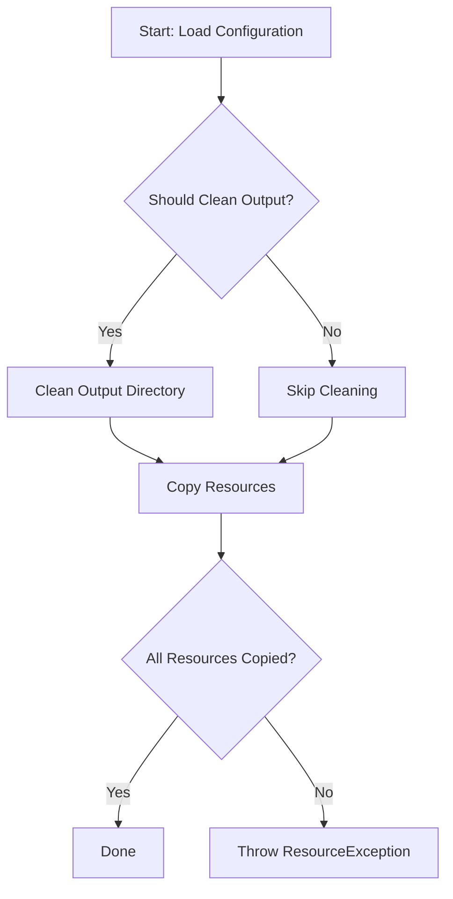

# PHP Packer Resource 工作流程（Mermaid）

```mermaid
flowchart TD
    A[Start: Load Configuration] --> B{Should Clean Output?}
    B -- Yes --> C[Clean Output Directory]
    B -- No --> D[Skip Cleaning]
    C --> E[Copy Resources]
    D --> E
    E --> F{All Resources Copied?}
    F -- Yes --> G[Done]
    F -- No --> H[Throw ResourceException]
```

> 本流程图描述了资源管理器的主要工作流程，包括加载配置、可选的输出目录清理，以及资源文件的复制。若资源复制失败，将抛出异常。
